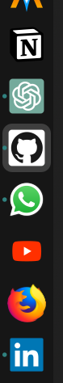

# Web App Shortcuts for Firefox - .deb Package

This repository provides desktop shortcuts for web apps using Firefox. It generates a .deb package that installs web apps as applications, complete with desktop files, icons, and a launcher. The shortcuts open the corresponding web apps in Firefox with a custom user profile.

Note that this .deb assumes wayland as WM.

# What This Repository Does

This project is a basically a .deb package providing firefox which curstom url and icons launchers (e.g., GitHub.com, etc.), the whole packageable in a `.deb`, which can then be installed on a Debian-based Linux system (Ubuntu, etc.). The package provides the following:

 - The `DEBIAN` folder with its configuration
 - A desktop shortcut for each web app.
 - An icon for each web app.
 - A launcher script that opens the web app in Firefox with specific configurations (custom profile, settings like --url, and other flags, --name and --class for tracking the process as a specific app).

Every shortcut is made of 3 components.

For example, the github.desktop file launches Firefox with a custom profile, opening https://github.com and displaying it with the Github window name.



# Files Included

1. Desktop Entry (/usr/local/applications/github.desktop)

    ```.desktop
    [Desktop Entry]
    Type=Application
    Name=Github
    Comment=Github in firefox
    Exec=github
    Icon=/usr/icons/github.svg
    Terminal=false
    ```

2. Icon (/usr/icons/github.svg)

3. Launcher Script (/usr/bin/github)

    ```.bash
    #!/usr/bin/env bash
    export MOZ_ENABLE_WAYLAND=1 
    exec -a github firefox -P github --url https://github.com --class Github --name Github
    ```

# Build the `.deb` Package

1. Clone this repository

`$ git clone <repo>`

2. Create the .deb package:
Note: Make sure you have make and `dpkg-deb` installed on your system.

`$ make all`

# Install the `.deb` Package

Once the `.deb` package is generated, you can install it by running:

`$ sudo dpkg -i <name>.deb`

Replace `<name>.deb` with the actual name of the `.deb` file.

After installation, the web app shortcut will be available in your application menu, and you can launch it just like any other desktop application.

# Customization Tips

Adding uBlock Origin to Firefox Profile

To block ads and trackers in the web app, you can add uBlock Origin to your Firefox profile.

 - Open Firefox and go to the uBlock Origin page.
 - Install uBlock Origin.
 - Go to about:addons and configure it as desired.

After that, your Firefox profile will block ads in the web app.

# Preventing New Tabs from Opening

To ensure that links open in the same tab/window instead of a new one, modify the following setting in Firefox's about:config:

 - Open Firefox and go to about:config in the address bar.
 - Search for browser.link.open_newwindow.restriction.
 - Set the value to 0 (This will force all links to open in the same tab/window).

This ensures that links clicked from within the web app will always open in the existing tab, instead of spawning a new tab.
